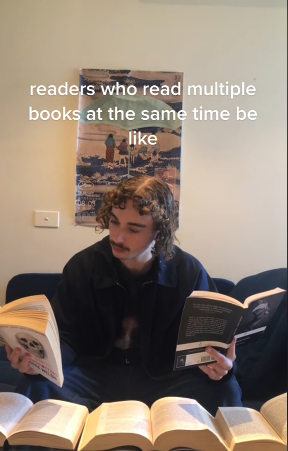

# 🛡️ CyberSec Library 📚  
*A curated library of cybersecurity books for the curious, the passionate, and the relentless.*

---

## 👋 Welcome!

Hello there! This is my personal collection of cybersecurity books, neatly organized and categorized for anyone who loves security as much as I do.

Since I got my first computer as a kid, I’ve been obsessed with how things work—and how to break them (ethically, of course 😉). That curiosity turned into passion, and now, I want to give back to the community with a free resource anyone can use to learn, explore, and grow in the field of cybersecurity.

---

## 🔎 What's Inside?

- 📂 **Category-based `.md` files** so you can jump straight to what interests you
- 🔗 **Links to buy/download** the books legally
- 🧠 **Motivational quotes** from cybersecurity legends
- ❤️ A personal touch—because tech is great, but passion is greater

---

## 🧠 Words of Wisdom

> “If you think technology can solve your security problems, then you don’t understand the problems and you don’t understand the technology.”  
> — *Bruce Schneier*

> “Security is not a product, but a process.”  
> — *Bruce Schneier* (yes, he’s that quotable)

> “Hackers are breaking the systems for profit. Before, it was about intellectual curiosity and pursuit of knowledge and thrill, and now hacking is big business.”  
> — *Kevin Mitnick*

---

## 💭 Real Talk

We live in an era of distraction. Everything is fast—notifications, trends, opportunities. It’s so easy to feel like you're falling behind, like you picked the wrong thing to focus on.

But here’s the truth: **Mastery takes time.**  
Stick to your path, even when it’s not shiny. Even when no one’s clapping yet. This library is a reminder that **deep focus** and **consistent learning** still matter.

Whether you’re starting out or knee-deep in exploits, keep going. 💻🔥

---

## 😂 Just for Fun

Here’s a friendly reminder of what it feels like when you try reading five cybersecurity books at once:

> *"Me: I’ll read one chapter before bed...*  
> *Also me at 3 AM: ‘If I just buffer overflow the stack and execute shellcode…’"* 😵‍💻

---

## ☕ Support the Grind

If you found this helpful and want to fuel my late-night reading (and debugging) sessions, feel free to [buy me a coffee](https://www.buymeacoffee.com/yourusername)!

---

**Stay sharp, stay curious, and don’t trust user input. 😈**